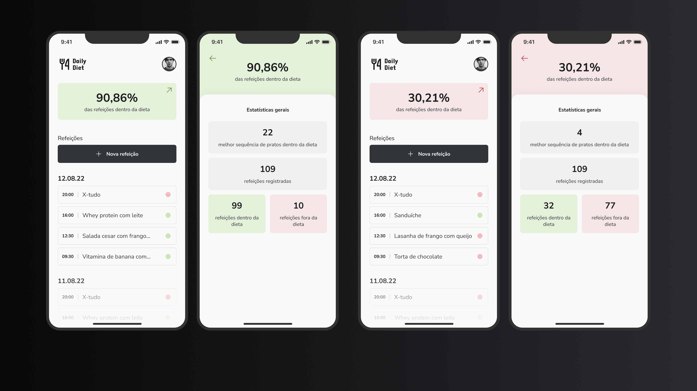
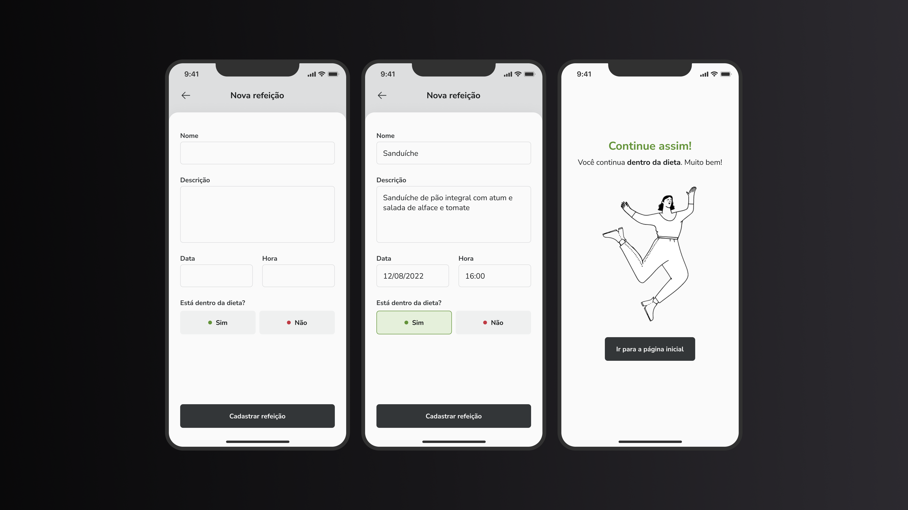
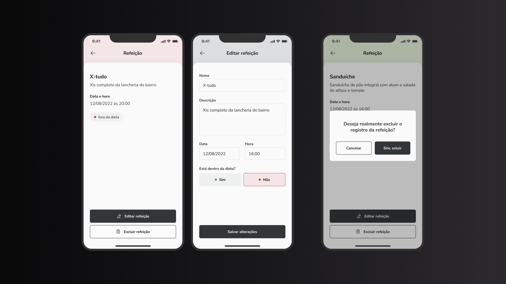

<h1 align="center">
   App Daily Diet
</h1>

<!-- Badges -->
<p align="center">
  
</p>

<!-- Indice-->
<p align="center">
 <a href="#-sobre-o-projeto">Sobre</a> •
 <a href="#-Funcionalidades">Funcionalidades</a> • 
 <a href="#-Preview">Preview</a> • 
 <a href="#-UI">UI</a> •  
 <a href="#-como-executar-o-projeto">Executando</a> • 
 <a href="#-tecnologias">Tecnologias</a> • 
 <a href="#-licença">Licença</a>
</p>

<!--Sobre o projeto-->

## 💻 Sobre o projeto

O projeto foi desenvolvido como um desafio do curso de React Native da [Rocketseat], o objetivo era aplicar os conceitos básicos aprendidos construindo um aplicativo de tarefas.

As funcionalidades foram apresentadas na descrição do desafio, além do design no **Figma**, além da adição de melhoria de performance, facilitando a escabilidade do projeto.

<!--Funcionalidades do projeto-->

## ⚙️ Funcionalidades

- [x] Adicionar uma nova refeição
- [x] Editar uma refeição
- [x] Remover uma refeição da listagem
- [x] Mostrar as estatísticas do progresso da dieta
- [x] Navegação entre telas em pilha
- [x] Armazenamento local das refeições

<!--UI-->

## 🎨 UI







<!--Running session-->

## 🚀 Como executar o projeto

```bash

# Clone o repositório
git clone https://github.com/suanev/dailydiet

# Instale as dependências
yarn install

# Execute o projeto
yarn start

# Abra outro terminal e inicie o projeto no emulador no android
yarn run android

# Ou no IOS

yarn run ios
```

---

<!--Tecnologies session-->

## 🛠 Tecnologias

As seguintes ferramentas foram usadas na construção do projeto:

- **[Styled Components](https://styled-components.com/)**
- **[TypeScript](https://www.typescriptlang.org/)**
- **[React Navigation](https://reactnavigation.org/)**
- **[React Native](https://reactnative.dev/)**

<!--License session-->

## 📝 Licença

Este projeto está sob a licença [MIT](./LICENSE).
